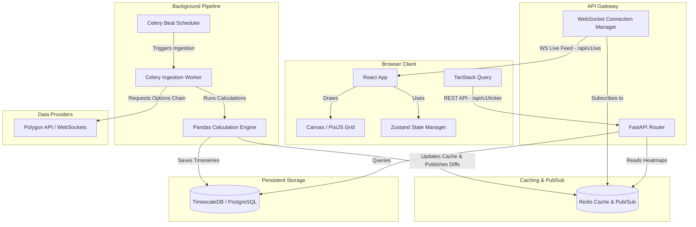
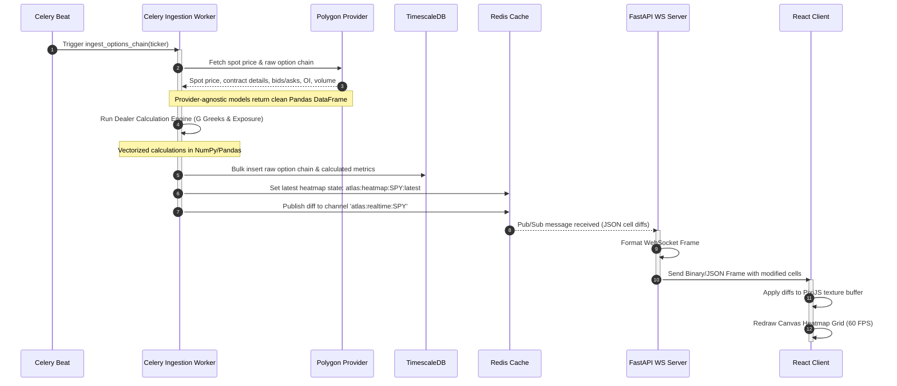
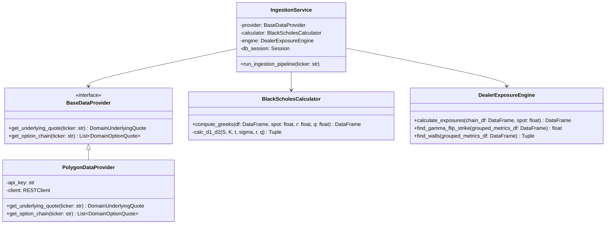
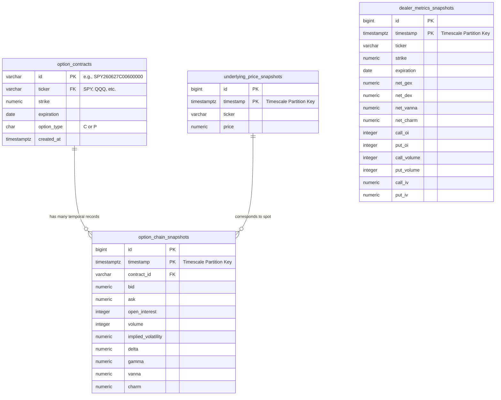
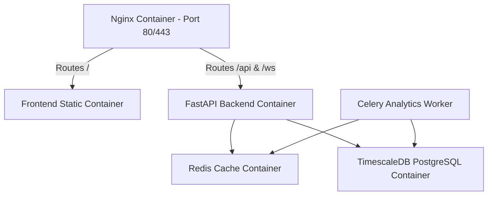
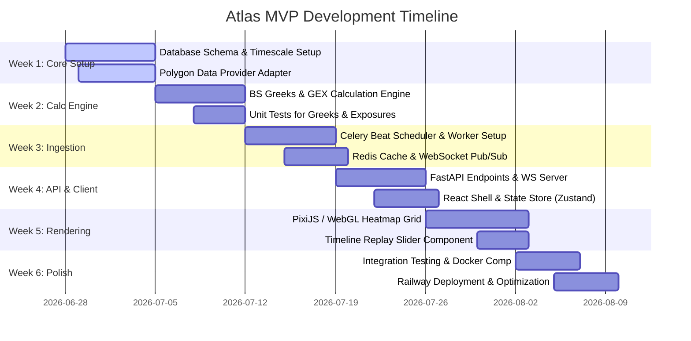

# Software Architecture Document: Atlas Options Dealer Positioning Platform

## 1. Executive Summary

### 1.1 Product Vision
Atlas is an institutional-grade dealer positioning analytics platform designed to visualize how options market maker exposure evolves across strike prices and expiration dates. Unlike traditional options analytics platforms that collapse options data into a single dimensional line chart (e.g., aggregate Gamma curves), Atlas preserves the multi-dimensional structure of the options market by visualizing exposure in a strike-expiration heatmap matrix. 

Atlas treats dealer positioning as a continuously evolving, dynamic market state. By capturing intra-day snapshots of the option chain and providing historical replay functionality, Atlas enables traders to witness the building and unwinding of dealer buffers (e.g., Gamma Walls, Delta Flips, and Charm/Vanna flows) in real-time or via replay.

```
                  +-----------------------------------+
                  |             Frontend              |
                  |  React, TypeScript, Vite, Zustand |
                  |  - WebGL/Canvas Heatmap (PixiJS)  |
                  |  - Plotly Charts, Replay Slider   |
                  +-----------------+-----------------+
                                    |
                                    | WebSockets (Real-time updates)
                                    | REST API (Historical/Init data)
                                    v
                  +-----------------------------------+
                  |          FastAPI Gateway          |
                  |  - Stateless Request Handling    |
                  |  - WebSocket Connection Pool     |
                  +--------+-----------------+--------+
                           |                 |
                           | Reads           | Pub/Sub & Caching
                           v                 v
            +--------------+---+     +-------+--------+
            |    TimescaleDB   |     |     Redis      |
            | (PostgreSQL core)|     |  - Heatmap Cache|
            | - Raw Snapshots  |     |  - Worker Locks |
            | - Dealer Metrics |     |  - Real-time Pub|
            +--------------+---+     +-------+--------+
                           ^                 ^
                           | Writes          | Publishes updates
                           +--------+--------+
                                    |
                  +-----------------+-----------------+
                  |         Celery Workers            |
                  |  - Option Chain Ingestion Task   |
                  |  - Vectorized Greeks Engine       |
                  |  - Heatmap Aggregation Engine     |
                  +-----------------+-----------------+
                                    |
                                    | External API Calls
                                    v
                  +-----------------------------------+
                  |        Data Provider (Polygon)     |
                  +-----------------------------------+
```

### 1.2 MVP Scope
The Minimum Viable Product (MVP) implements the end-to-end data pipeline, calculation engine, database storage, caching, API gateway, and heatmap visualization for three major indexes/ETFs:
*   **SPY** (S&P 500 ETF)
*   **QQQ** (Nasdaq 100 ETF)
*   **IWM** (Russell 2000 ETF)

The MVP is designed for a single concurrent user (the researcher/trader) running locally via Docker Compose or deployed to a lightweight cloud environment (Railway). However, the software interfaces and data layers are explicitly designed to support multi-tenancy, arbitrary optionable symbols, and multiple market data providers in subsequent releases.

---

## 2. System Requirements

### 2.1 Functional Requirements
*   **FR-1: Data Ingestion Pipeline**
    *   Ingest live options chains (including prices, volume, open interest, and implied volatility) for SPY, QQQ, and IWM at 1-minute intervals during market hours (09:30 - 16:00 EST).
    *   Fetch underlying spot price snapshots at the same 1-minute frequency.
*   **FR-2: Dealer Analytics Engine**
    *   Compute real-time Greeks ($\Delta$, $\Gamma$, Vanna, Charm) for every individual option contract using the Black-Scholes-Merton model if not provided by the data source.
    *   Compute dealer-specific exposure metrics (Net GEX, Call Gamma, Put Gamma, Net DEX, Vanna Exposure, Charm Exposure) at each strike and expiration.
    *   Store both computed dealer metrics and raw option contract chains historically.
*   **FR-3: Matrix Heatmap Visualization**
    *   Render a high-performance grid where $y$-axis represents strike prices and $x$-axis represents expiration dates.
    *   Dynamically color cells based on selected metric values (Green = Positive/Long Dealer, Red = Negative/Short Dealer).
    *   Dynamically scale brightness of cells to represent percentile magnitude relative to historical values.
    *   Support switching between metrics (Net GEX, Delta, Open Interest, Volume, IV) without triggering a backend recalculation.
*   **FR-4: Interactive Replay Engine**
    *   Provide a timeline slider allowing the user to select any 1-minute snapshot from the active trading session.
    *   Support VCR-like play, pause, fast-forward, and rewind controls to replay market mechanics sequentially.
*   **FR-5: Spot Price & Key Levels Overlay**
    *   Highlight the row corresponding to the current underlying spot price.
    *   Calculate and display key structural levels: Gamma Flip strike, Call Wall (strike with highest positive GEX), and Put Wall (strike with highest negative GEX).

### 2.2 Non-Functional Requirements
*   **NFR-1: API Latency**
    *   FastAPI backend endpoints must return initial payload configurations and metadata in under 100 milliseconds under normal operation.
*   **NFR-2: Real-Time Stream Latency**
    *   End-to-end latency from data ingestion completion to frontend render update must be under 150 milliseconds.
*   **NFR-3: Heatmap Rendering Performance**
    *   The heatmap must render at a consistent 60 Frames Per Second (FPS) during scrolls, zooms, and hover events, managing grids containing up to 25,000 active cells (500 strikes $\times$ 50 expirations) without browser freezing.
*   **NFR-4: Storage Efficiency**
    *   Raw and processed timeseries data must be partitioned (using TimescaleDB hypertables) to maintain queries and database insertions at O(1) complexity. Older data must be easily compressible or archivable.
*   **NFR-5: Extensibility**
    *   Changing the underlying market data provider (e.g., from Polygon to ThetaData) must only require implementing a predefined Python interface class, with zero changes to calculations, DB schema, or frontend.

---

## 3. High-Level Architecture & Component Design

The platform uses a decoupled microservices architecture containerized using Docker. Communication between the user client and backend uses a hybrid protocol approach: REST for static configurations and initial historical loads, and WebSockets for real-time incremental updates.

### 3.1 Component Architecture Diagram



### 3.2 Sequence Diagram: 1-Minute Live Data Ingestion & Broadcast



---

## 4. Backend Architecture & Engine Design

### 4.1 Directory Structure
The backend is structured to separate concerns between database operations, domain calculation logic, and API transportation layers.

```
backend/
├── app/
│   ├── api/
│   │   ├── __init__.py
│   │   ├── deps.py             # FastAPI dependency injection (DB sessions, cache clients)
│   │   ├── endpoints/
│   │   │   ├── auth.py         # Placeholder for future multi-user auth
│   │   │   ├── heatmap.py      # Heatmap history & state retrieval
│   │   │   └── tickers.py      # Available symbols & metadata
│   │   └── websockets/
│   │       └── feed.py         # Real-time WebSocket router & pool manager
│   ├── core/
│   │   ├── config.py           # Pydantic BaseSettings config matching environment variables
│   │   └── security.py
│   ├── db/
│   │   ├── base.py             # Import all SQLAlchemy models for migration discovery
│   │   ├── base_class.py       # Custom declarative base model
│   │   └── session.py          # TimescaleDB session generators & engine instantiation
│   ├── models/
│   │   ├── contract.py         # OptionContract model (static details)
│   │   ├── metric.py           # DealerMetricSnapshot model (timeseries)
│   │   ├── snapshot.py         # OptionChainSnapshot model (raw timeseries)
│   │   └── underlying.py       # UnderlyingPriceSnapshot model (timeseries)
│   ├── schemas/
│   │   ├── heatmap.py          # Pydantic schemas for REST responses
│   │   └── websocket.py        # Pydantic schemas for WS messages & diffs
│   ├── services/
│   │   ├── analytics.py        # Business logic for GEX calculations & Gamma Flips
│   │   ├── ingestion.py        # Orchestrates fetching and saving to DB
│   │   └── data_providers/
│   │       ├── __init__.py
│   │       ├── base.py         # Abstract base data provider class
│   │       └── polygon.py      # Polygon implementation using REST/WebSockets
│   └── workers/
│       ├── celery_app.py       # Instantiates Celery application
│       └── tasks.py            # Celery task definitions (scheduled worker pipelines)
├── tests/
│   ├── conftest.py
│   ├── test_analytics.py       # Validates Black-Scholes formulas & GEX math
│   └── test_api.py             # Validates FastAPI endpoints
├── Dockerfile
├── requirements.txt
└── alembic.ini                 # DB Migration config
```

### 4.2 Provider Interface (Abstraction Layer)

To satisfy **NFR-5**, we define a strict interface for data providers. Any concrete provider (Polygon, ThetaData, etc.) must implement this interface and map their custom models to internal domain schemas.

```python
# app/services/data_providers/base.py
from abc import ABC, abstractmethod
from datetime import date
from typing import List, Tuple
import pandas as pd
from pydantic import BaseModel

class DomainUnderlyingQuote(BaseModel):
    ticker: str
    price: float
    timestamp_utc: int

class DomainOptionQuote(BaseModel):
    contract_symbol: str        # e.g., SPY260627C00600000
    strike: float
    expiration: date
    option_type: str            # "C" or "P"
    open_interest: int
    volume: int
    bid: float
    ask: float
    implied_volatility: float   # Can be None if computed internally
    delta: float = None         # Can be None if computed internally
    gamma: float = None         # Can be None if computed internally

class BaseDataProvider(ABC):
    
    @abstractmethod
    def get_underlying_quote(self, ticker: str) -> DomainUnderlyingQuote:
        """Fetches the latest spot price snapshot of the underlying index/ETF."""
        pass

    @abstractmethod
    def get_option_chain(self, ticker: str) -> List[DomainOptionQuote]:
        """Fetches the complete active option chain snapshot for the ticker."""
        pass
```

### 4.3 Python Class Diagram (Data Ingestion & Calculation)



---

## 5. Mathematical Foundations & Calculation Engine

The primary metrics calculated by the background worker use Black-Scholes Greeks. The calculations must be vectorized in Pandas and NumPy to maintain high performance.

### 5.1 Black-Scholes Greeks (Standard Definitions)
Let:
*   $S$ = Spot price of the underlying asset
*   $K$ = Strike price of the option contract
*   $t$ = Time to expiration in years ($t = \frac{\text{Days to Expiration}}{365.25}$)
*   $\sigma$ = Implied volatility of the contract
*   $r$ = Risk-free interest rate (e.g., 3-month U.S. Treasury Bill yield)
*   $q$ = Dividend yield (e.g., S&P 500 average dividend yield)

We compute the auxiliary variables $d_1$ and $d_2$:
$$d_1 = \frac{\ln(S/K) + \left(r - q + \frac{\sigma^2}{2}\right)t}{\sigma \sqrt{t}}$$
$$d_2 = d_1 - \sigma \sqrt{t}$$

Where $N(x)$ is the cumulative standard normal distribution function, and $n(x)$ is the standard normal probability density function:
$$N(x) = \frac{1}{\sqrt{2\pi}} \int_{-\infty}^{x} e^{-\frac{u^2}{2}} du$$
$$n(x) = \frac{1}{\sqrt{2\pi}} e^{-\frac{x^2}{2}}$$

The required Greeks are calculated as follows:

#### Delta ($\Delta$)
Sensitivity of the option price to changes in the underlying asset's price.
$$\Delta_{\text{Call}} = e^{-qt} N(d_1)$$
$$\Delta_{\text{Put}} = e^{-qt} \left(N(d_1) - 1\right)$$

#### Gamma ($\Gamma$)
Sensitivity of the option Delta to changes in the underlying asset's price. Same for Calls and Puts.
$$\Gamma = \frac{e^{-qt} n(d_1)}{S \sigma \sqrt{t}}$$

#### Vanna ($V$)
Sensitivity of the option Delta to changes in implied volatility. Same for Calls and Puts.
$$\text{Vanna} = \frac{\partial \Delta}{\partial \sigma} = -e^{-qt} n(d_1) \frac{d_2}{\sigma}$$

#### Charm ($C$ / Delta Decay)
Rate of change of the option Delta relative to time passage.
$$\text{Charm}_{\text{Call}} = -\frac{\partial \Delta_{\text{Call}}}{\partial t} = - q e^{-qt} N(d_1) + e^{-qt} n(d_1) \left[ \frac{r - q}{\sigma \sqrt{t}} - \frac{d_2}{2t} \right]$$
$$\text{Charm}_{\text{Put}} = -\frac{\partial \Delta_{\text{Put}}}{\partial t} = q e^{-qt} (1 - N(d_1)) + e^{-qt} n(d_1) \left[ \frac{r - q}{\sigma \sqrt{t}} - \frac{d_2}{2t} \right]$$

---

### 5.2 Dealer Exposure Calculations
Under standard market assumptions, retail traders tend to buy calls and buy puts (long option positions), which implies options market makers (dealers) are net **short** retail's position. However, institutional flows show that retail is net **long calls** and net **long puts** (buying options for speculation and hedging). 

To reflect this standard "Short Put, Long Call" dealer profiling, we use the following equations to model Net Dealer Exposure.

Let $OI_i$ represent the Open Interest of option contract $i$. Each option contract covers 100 shares.

#### Net Gamma Exposure (GEX)
Net GEX measures the dollar value of stock dealers must buy or sell to remain delta-hedged if the underlying asset moves by 1%.
$$\text{GEX}_{\text{Call}, i} = OI_i \times \Gamma_i \times 100 \times S^2 \times 0.01$$
$$\text{GEX}_{\text{Put}, i} = -OI_i \times \Gamma_i \times 100 \times S^2 \times 0.01$$
$$\text{Net GEX}_{\text{Strike } K, \text{ Expiration } T} = \sum_{C_i \in K, T} \text{GEX}_{\text{Call}, i} + \sum_{P_j \in K, T} \text{GEX}_{\text{Put}, j}$$

#### Net Delta Exposure (DEX)
Net DEX measures the dollar value of stock dealers must hold to hedge their aggregate options delta.
$$\text{DEX}_{\text{Call}, i} = OI_i \times \Delta_{\text{Call}, i} \times 100 \times S$$
$$\text{DEX}_{\text{Put}, i} = -OI_i \times \Delta_{\text{Put}, i} \times 100 \times S$$
$$\text{Net DEX}_{\text{Strike } K, \text{ Expiration } T} = \sum_{C_i \in K, T} \text{DEX}_{\text{Call}, i} + \sum_{P_j \in K, T} \text{DEX}_{\text{Put}, j}$$

#### Net Vanna Exposure (VEX)
Vanna exposure evaluates the change in dealer delta exposure per 1% absolute increase in implied volatility.
$$\text{VEX}_{\text{Call}, i} = OI_i \times \text{Vanna}_i \times 100 \times S \times 0.01$$
$$\text{VEX}_{\text{Put}, i} = -OI_i \times \text{Vanna}_i \times 100 \times S \times 0.01$$
$$\text{Net VEX}_{\text{Strike } K, \text{ Expiration } T} = \sum_{C_i \in K, T} \text{VEX}_{\text{Call}, i} + \sum_{P_j \in K, T} \text{VEX}_{\text{Put}, j}$$

#### Net Charm Exposure (CEX)
Charm exposure evaluates the change in dealer delta exposure per calendar day passing, assuming spot price and volatility remain static.
$$\text{CEX}_{\text{Call}, i} = OI_i \times \text{Charm}_{\text{Call}, i} \times 100 \times S$$
$$\text{CEX}_{\text{Put}, i} = -OI_i \times \text{Charm}_{\text{Put}, i} \times 100 \times S$$
$$\text{Net CEX}_{\text{Strike } K, \text{ Expiration } T} = \sum_{C_i \in K, T} \text{CEX}_{\text{Call}, i} + \sum_{P_j \in K, T} \text{CEX}_{\text{Put}, j}$$

#### Gamma Flip Strike
The Gamma Flip Strike $S^*$ is defined as the strike price where the aggregated Net GEX across all expirations changes sign from negative (short Gamma) to positive (long Gamma):
$$\text{Aggregate GEX}(S) = \sum_{K, T} \text{Net GEX}_{K, T}(S)$$
$$S^* = \{S \in \mathbb{R} \mid \text{Aggregate GEX}(S) = 0 \}$$
In practice, the background worker finds $S^*$ by interpolating the aggregate GEX curve over strikes and finding its roots.

---

## 6. Database Schema Design

Atlas utilizes PostgreSQL with the TimescaleDB extension. This provides standard SQL capabilities for relational metadata (like option contract specs) alongside optimized hypertables for high-frequency time-series datasets.

### 6.1 Database Schema Diagram (ERD)



### 6.2 Data Definition Language (DDL)

```sql
-- Create standard extensions
CREATE EXTENSION IF NOT EXISTS "uuid-ossp";
CREATE EXTENSION IF NOT EXISTS "timescaledb";

-- 1. Static metadata table for option contracts (reduces duplicate string allocations in time series)
CREATE TABLE option_contracts (
    id VARCHAR(50) PRIMARY KEY, -- standard OCC contract symbol style
    ticker VARCHAR(10) NOT NULL,
    strike NUMERIC(10, 2) NOT NULL,
    expiration DATE NOT NULL,
    option_type CHAR(1) NOT NULL CHECK (option_type IN ('C', 'P')),
    created_at TIMESTAMPTZ NOT NULL DEFAULT NOW()
);
CREATE INDEX idx_contracts_ticker ON option_contracts (ticker);

-- 2. Time-series table for underlying spot prices
CREATE TABLE underlying_price_snapshots (
    id BIGSERIAL,
    timestamp TIMESTAMPTZ NOT NULL,
    ticker VARCHAR(10) NOT NULL,
    price NUMERIC(12, 4) NOT NULL,
    PRIMARY KEY (timestamp, id)
);
-- Convert to Hypertable partitioned by 1-day intervals
SELECT create_hypertable('underlying_price_snapshots', 'timestamp', chunk_time_interval => INTERVAL '1 day');

-- 3. Time-series table for raw option chain snapshots
CREATE TABLE option_chain_snapshots (
    id BIGSERIAL,
    timestamp TIMESTAMPTZ NOT NULL,
    contract_id VARCHAR(50) NOT NULL REFERENCES option_contracts(id),
    bid NUMERIC(10, 2),
    ask NUMERIC(10, 2),
    open_interest INTEGER NOT NULL,
    volume INTEGER NOT NULL,
    implied_volatility NUMERIC(8, 6),
    delta NUMERIC(8, 6),
    gamma NUMERIC(10, 8),
    vanna NUMERIC(10, 8),
    charm NUMERIC(10, 8),
    PRIMARY KEY (timestamp, id)
);
SELECT create_hypertable('option_chain_snapshots', 'timestamp', chunk_time_interval => INTERVAL '1 day');
CREATE INDEX idx_chain_snapshots_contract ON option_chain_snapshots (contract_id, timestamp DESC);

-- 4. Aggregated dealer metrics table (used directly by the Heatmap API)
CREATE TABLE dealer_metrics_snapshots (
    id BIGSERIAL,
    timestamp TIMESTAMPTZ NOT NULL,
    ticker VARCHAR(10) NOT NULL,
    strike NUMERIC(10, 2) NOT NULL,
    expiration DATE NOT NULL,
    net_gex NUMERIC(18, 2) NOT NULL,
    net_dex NUMERIC(18, 2) NOT NULL,
    net_vanna NUMERIC(18, 2) NOT NULL,
    net_charm NUMERIC(18, 2) NOT NULL,
    call_oi INTEGER NOT NULL,
    put_oi INTEGER NOT NULL,
    call_volume INTEGER NOT NULL,
    put_volume INTEGER NOT NULL,
    call_iv NUMERIC(8, 6),
    put_iv NUMERIC(8, 6),
    PRIMARY KEY (timestamp, id)
);
SELECT create_hypertable('dealer_metrics_snapshots', 'timestamp', chunk_time_interval => INTERVAL '1 day');
CREATE INDEX idx_dealer_metrics_lookup ON dealer_metrics_snapshots (ticker, timestamp DESC, strike, expiration);
```

---

## 7. Caching and Memory Strategy (Redis)

To meet **NFR-1** and **NFR-2**, Redis operates both as an in-memory database cache for calculated heatmap outputs and as a real-time event broker.

```
       WORKER CALCULATIONS COMPLETED
                     │
                     ▼
           Update Redis Cache
   SET "atlas:heatmap:SPY:latest" (Binary Msgpack Matrix)
                     │
                     ▼
             Publish Live Diff
   PUBLISH "atlas:realtime:SPY" (JSON cell changes)
                     │
         ┌───────────┴───────────┐
         ▼                       ▼
   FastAPI Connection Pool    FastAPI Connection Pool
  (Active Client Session 1)  (Active Client Session 2)
         │                       │
         ▼                       ▼
   WebSocket Frame          WebSocket Frame
 (Client Canvas Updates)  (Client Canvas Updates)
```

### 7.1 Heatmap Caching
The calculated aggregated heatmap state for a given ticker and timestamp is stored in Redis.
*   **Key Format**: `atlas:heatmap:{ticker}:{timestamp}`
*   **Data Format**: Msgpack binary representation containing an array of floats mapped to strike-expiration grids to minimize bandwidth overhead.
*   **Latest Key**: `atlas:heatmap:{ticker}:latest` points to the most recently computed snapshot, enabling new frontend clients to load the current view instantly without database queries.
*   **Cache Retention Policy**: Volatile-LRU with keys expired after 24 hours. Historical queries bypass cache if missing, running analytical selects against TimescaleDB and populating the cache on the fly.

### 7.2 WebSockets Pub/Sub & Cell Diffs
Instead of broadcasting the entire heatmap (~10,000 cells) every minute over WebSockets, the calculation engine calculates cell differences relative to the prior minute:
$$\text{Cell Diff}_{K, T} = \text{Metric}_{K, T}(t) - \text{Metric}_{K, T}(t - 1)$$
Only cells where the absolute difference exceeds a predefined noise threshold (e.g., $| \text{Diff} | > 0.001\%$) are broadcasted.

*   **Redis Pub/Sub Channel**: `atlas:realtime:{ticker}`
*   **Diff Payload (JSON)**:
    ```json
    {
      "ticker": "SPY",
      "timestamp": "2026-06-27T08:30:00-05:00",
      "spot_price": 542.12,
      "gamma_flip": 540.00,
      "call_wall": 545.00,
      "put_wall": 535.00,
      "diffs": [
        {"k": 540.00, "e": "2026-06-28", "g": 1250000.0, "oi": 5420, "v": 1200},
        {"k": 541.00, "e": "2026-06-28", "g": -450000.0, "oi": 2100, "v": 850}
      ]
    }
    ```

---

## 8. Transportation & API Design (FastAPI)

### 8.1 REST Endpoints

#### 8.1.1 GET `/api/v1/tickers`
Returns list of supported tickers, their current trading availability, and dates containing historical snapshot data.
*   **Response Payload**:
    ```json
    {
      "tickers": [
        {
          "symbol": "SPY",
          "name": "SPDR S&P 500 ETF Trust",
          "min_date": "2026-01-01",
          "max_date": "2026-06-27"
        }
      ]
    }
    ```

#### 8.1.2 GET `/api/v1/heatmap/{ticker}`
Retrieves a static snapshot of the dealer positioning matrix for a given timestamp.
*   **Query Parameters**:
    *   `timestamp`: ISO 8601 string. If omitted, returns the latest computed snapshot.
    *   `metric`: Filter for specific metric (`net_gex`, `net_dex`, `vanna`, `charm`, `call_oi`, `put_oi`, `volume`).
*   **Response Payload**:
    ```json
    {
      "ticker": "SPY",
      "timestamp": "2026-06-27T08:30:00-05:00",
      "spot_price": 542.12,
      "gamma_flip": 540.00,
      "call_wall": 545.00,
      "put_wall": 535.00,
      "columns": ["2026-06-27", "2026-06-28", "2026-07-03", "2026-07-17"],
      "rows": [545.00, 544.00, 543.00, 542.00, 541.00, 540.00],
      "data": [
        [1.25, 0.45, 0.22, 5.21],
        [0.85, 0.15, -0.12, 2.11],
        [-0.45, -0.95, -2.40, -4.10]
      ]
    }
    ```

#### 8.1.3 GET `/api/v1/replay/timeline/{ticker}`
Returns a list of all historical 1-minute Unix timestamps available for a given date to populate the slider increments.
*   **Query Parameters**:
    *   `date`: YYYY-MM-DD string.
*   **Response Payload**:
    ```json
    {
      "ticker": "SPY",
      "date": "2026-06-27",
      "timestamps": [1782551400, 1782551460, 1782551520, 1782551580]
    }
    ```

### 8.2 WebSocket Connection Manager
Real-time clients establish a persistent connection to subscribe to ticker feeds.

*   **URL**: `ws://<domain>/api/v1/ws/{ticker}`
*   **Lifecycle Protocol Flow**:
    1.  **Connection**: Client initiates WS connection with a ticker parameter.
    2.  **Handshake / Init**: Server accepts connection, sends the latest full state snapshot:
        `{"type": "INIT", "payload": { <Full Heatmap JSON> }}`
    3.  **Subscription**: Client remains idle. The server WebSocket manager subscribes to the Redis pub/sub channel for that ticker.
    4.  **Streaming**: Whenever the Redis channel receives calculated update diffs from the worker, the server translates it and forwards the payload:
        `{"type": "PATCH", "payload": { <Diff JSON> }}`
    5.  **Heartbeat**: Client sends ping frames every 30 seconds; server replies with pong to prevent TCP connection timeouts.

---

## 9. Frontend Architecture & Heatmap Rendering

The frontend uses React and TypeScript built with Vite. Since rendering up to 25,000 cells via standard HTML DOM nodes (or SVG elements) degrades scroll performance and causes garbage collection spikes, Atlas employs a WebGL/Canvas rendering pipeline utilizing PixiJS.

### 9.1 Component Tree Hierarchy

```
App.tsx (Main Layout Provider)
├── Header (Ticker Selector, Status Badges, System Metrics)
├── Workspace (Flex Layout)
│   ├── Sidebar (Detailed Metrics Inspector & Cell Info Panel)
│   ├── HeatmapContainer (Main Viewport)
│   │   ├── MetricControls (Switch GEX, DEX, Volume, etc.)
│   │   └── CanvasHeatmap (PixiJS/HTML5 Canvas WebGL Stage)
│   └── LevelAggregations (Gamma Curve Plotly Chart / Side Panels)
└── TimelineControls (Footer)
    ├── PlayControls (Play, Pause, Speed Multiplier)
    └── TimelineSlider (TanStack Slider / Timeline navigation)
```

### 9.2 PixiJS Heatmap Renderer Design

```
                   PIXI.Application (WebGL Stage)
                                 │
         ┌───────────────────────┼───────────────────────┐
         ▼                       ▼                       ▼
  Strikes Axis Container   Expirations Axis   Heatmap Cells Container
 (Static Text Labels)    (Rotated Labels)     (Dynamic Grid Sprites)
                                                         │
                                                         ▼
                                                Viewport Virtualization
                                             (Draws only visible bounds)
```

*   **Graphics Pipeline Optimization**:
    *   Rather than rendering thousands of distinct `PIXI.Graphics` rectangle objects (which adds draw call overhead), we generate a single **ParticleContainer** or update a raw **Float32Array WebGL Texture** matching the dimensions of the grid.
    *   **Double Buffering**: Maintain a background canvas buffer. The engine writes grid values to buffer bytes, updates color shading on CPU/GPU, and swaps the target render texture in one frame.
*   **Viewport Virtualization**:
    *   During zoom and panning operations, the drawing routine calculates the boundary coordinates:
        `minVisibleStrike`, `maxVisibleStrike`, `minVisibleExpiration`, `maxVisibleExpiration`.
    *   Only cells matching these index bounds are processed by the PixiJS drawing loop, maintaining FPS above 60.
*   **Interaction Layer**:
    *   A custom mouse-move event listener on the Canvas matches mouse local coordinates $(x,y)$ to index values:
        $$\text{ColIdx} = \text{Math.floor}\left(\frac{x - \text{margin}_{\text{left}}}{\text{cellWidth}}\right)$$
        $$\text{RowIdx} = \text{Math.floor}\left(\frac{y - \text{margin}_{\text{top}}}{\text{cellHeight}}\right)$$
    *   The mapped cell triggers a React State dispatch to populate the **Sidebar inspector panel** with detailed options contract info.

### 9.3 Frontend State Management (Zustand)
The global state tree stores active views, loaded symbols, timeline positions, and play statuses.

```typescript
interface GlobalAppState {
  activeTicker: string;
  selectedMetric: 'net_gex' | 'net_dex' | 'vanna' | 'charm' | 'oi' | 'volume';
  currentTimestamp: number | null;
  isPlaying: boolean;
  replaySpeed: number; // e.g. 1x, 5x, 10x, 60x
  spotPrice: number | null;
  gammaFlip: number | null;
  callWall: number | null;
  putWall: number | null;
  
  // Actions
  setTicker: (ticker: string) => void;
  setMetric: (metric: string) => void;
  setTimestamp: (ts: number) => void;
  togglePlay: () => void;
  setReplaySpeed: (speed: number) => void;
  updateMarketLevels: (spot: number, flip: number, call: number, put: number) => void;
}
```

---

## 10. DevOps, Deployment, and Infrastructure

### 10.1 Docker Container Strategy
To ensure complete portability between local environments and cloud providers, Atlas is split into five distinct Docker images run via a `docker-compose` definition.



#### Multi-stage Dockerfile: FastAPI Backend
```dockerfile
# backend/Dockerfile
FROM python:3.11-slim as base

ENV PYTHONUNBUFFERED=1 \
    PYTHONDONTWRITEBYTECODE=1 \
    PIP_NO_CACHE_DIR=off \
    PIP_DISABLE_PIP_VERSION_CHECK=on

WORKDIR /app

FROM base as builder
RUN apt-get update && apt-get install -y --no-install-recommends \
    build-essential \
    libpq-dev \
    && rm -rf /var/lib/apt/lists/*

COPY requirements.txt .
RUN pip install --user -r requirements.txt

FROM base as final
RUN apt-get update && apt-get install -y --no-install-recommends \
    libpq5 \
    && rm -rf /var/lib/apt/lists/*

COPY --from=builder /root/.local /root/.local
ENV PATH=/root/.local/bin:$PATH

COPY . .

EXPOSE 8000
CMD ["uvicorn", "app.main:app", "--host", "0.0.0.0", "--port", "8000"]
```

### 10.2 Docker Compose Configuration (Development / Production Setup)
```yaml
# docker-compose.yml
version: '3.8'

services:
  db:
    image: timescale/timescaledb:latest-pg15
    container_name: atlas_db
    environment:
      - POSTGRES_DB=atlas
      - POSTGRES_USER=postgres
      - POSTGRES_PASSWORD=secretpassword
    ports:
      - "5432:5432"
    volumes:
      - pgdata:/var/lib/postgresql/data
    healthcheck:
      test: ["CMD-SHELL", "pg_isready -U postgres -d atlas"]
      interval: 5s
      timeout: 5s
      retries: 5

  redis:
    image: redis:7-alpine
    container_name: atlas_redis
    ports:
      - "6379:6379"
    volumes:
      - redisdata:/data
    healthcheck:
      test: ["CMD", "redis-cli", "ping"]
      interval: 5s
      timeout: 5s
      retries: 5

  api:
    build:
      context: ./backend
    container_name: atlas_api
    command: uvicorn app.main:app --host 0.0.0.0 --port 8000 --reload
    environment:
      - DATABASE_URL=postgresql://postgres:secretpassword@db:5432/atlas
      - REDIS_URL=redis://redis:6379/0
      - POLYGON_API_KEY=${POLYGON_API_KEY}
    ports:
      - "8000:8000"
    depends_on:
      db:
        condition: service_healthy
      redis:
        condition: service_healthy

  worker:
    build:
      context: ./backend
    container_name: atlas_worker
    command: celery -A app.workers.celery_app worker --loglevel=info
    environment:
      - DATABASE_URL=postgresql://postgres:secretpassword@db:5432/atlas
      - REDIS_URL=redis://redis:6379/0
      - POLYGON_API_KEY=${POLYGON_API_KEY}
    depends_on:
      db:
        condition: service_healthy
      redis:
        condition: service_healthy

  beat:
    build:
      context: ./backend
    container_name: atlas_beat
    command: celery -A app.workers.celery_app beat --loglevel=info
    environment:
      - DATABASE_URL=postgresql://postgres:secretpassword@db:5432/atlas
      - REDIS_URL=redis://redis:6379/0
    depends_on:
      db:
        condition: service_healthy
      redis:
        condition: service_healthy

  frontend:
    build:
      context: ./frontend
    container_name: atlas_frontend
    ports:
      - "3000:3000"
    environment:
      - VITE_API_URL=http://localhost:8000
    depends_on:
      - api

volumes:
  pgdata:
  redisdata:
```

### 10.3 Cloud Infrastructure Roadmap
1.  **Phase 1: Railway Deployment (MVP)**
    *   Provision a Railway project linking the GitHub repository.
    *   Spin up a Managed PostgreSQL plugin (enable TimescaleDB extension manually or via schema initialization scripts) and Managed Redis.
    *   Deploy `api` and `worker` services directly using the custom Dockerfiles, mapping env variables `DATABASE_URL` and `REDIS_URL` via Railway bindings.
    *   Automate deployment triggers on main branch commits.
2.  **Phase 2: DigitalOcean Single-node VPS (Production)**
    *   Provision a 4GB RAM CPU-optimized Droplet.
    *   Install Docker and Docker Compose.
    *   Utilize Cloudflare as DNS provider and SSL termination layer.
    *   Install Nginx on host or as a Docker container to route incoming traffic, handle WebSockets proxy configurations (`Upgrade $http_upgrade` headers), and serve frontend build output.

---

## 11. Testing and Verification Strategy

To guarantee the reliability of financial calculations and raw data ingestion, Atlas outlines a structured testing pyramid.

```
       ┌────────────────────────────────────────────────────────┐
       │                       E2E Tests                        │
       │           Mock data providers & verify API             │
       ├────────────────────────────────────────────────────────┤
       │                   Integration Tests                    │
       │       Verify DB insertions and Timescale hypertable     │
       ├────────────────────────────────────────────────────────┤
       │                      Unit Tests                        │
       │   Verify Black-Scholes formulas, Vanna, Charm, GEX     │
       └────────────────────────────────────────────────────────┘
```

### 11.1 Unit Tests (Math Calculations)
Verify that standard calculations remain mathematically correct. Test cases must check:
*   Standard options pricing edge cases (e.g., $t \to 0$ does not divide by zero).
*   Correct signs for Call vs. Put Greeks under Dealer Short/Long models.
*   Matrix aggregation functions return exact row/column bounds.

### 11.2 Integration Tests (Database & Pipelines)
*   Ensure that the celery task correctly triggers the Polygon provider mock.
*   Assert that saving data to PostgreSQL parses structures into appropriate `option_contracts` tables and Timescale hypertables.
*   Verify that Redis pub/sub sends the correct format message whenever a new model database commit completes.

### 11.3 Performance / Load Profiling
*   Implement stress testing scripts simulating 100 concurrent WebSocket connections to measure FastAPI thread pool performance.
*   Simulate high-density option chains with up to 35,000 active strikes to monitor worker execution times. The ingestion, calculation, and database commit loop must complete in **under 15 seconds** to prevent queue backups.

---

## 12. Project Roadmap

### 12.1 MVP Implementation Roadmap (6-Week Iteration Plan)



*   **Week 1: Foundations & Connections**
    *   Setup database schema using Postgres/TimescaleDB.
    *   Write the basic abstract base provider classes.
    *   Write `PolygonDataProvider` querying Polygon's REST endpoints for option chains.
*   **Week 2: Greeks Engine**
    *   Implement Vectorized Black-Scholes calculation scripts in NumPy/Pandas.
    *   Implement GEX, DEX, Vanna, and Charm calculation scripts.
    *   Write strict unit tests confirming Greek outputs align with industry standard benchmarks (e.g. comparing calculations against standard Quantitative packages like QuantLib).
*   **Week 3: Pipelines & Streaming**
    *   Wire up Celery workers to orchestrate fetching options chains and storing snapshots to DB.
    *   Setup Redis cache structure and publish message payloads on completing snapshot generation.
*   **Week 4: API & Core Interface**
    *   Build FastAPI router supporting initial config, timeline history, and WebSocket stream handlers.
    *   Construct React application boilerplate, config Zustand global state, and integrate REST queries.
*   **Week 5: Canvas Grid Heatmap**
    *   Build the PixiJS canvas matrix renderer.
    *   Integrate viewport virtualization & mouse hover tracking.
    *   Implement the Play/Pause/Replay timeline engine linking to frontend state.
*   **Week 6: Integration & Infrastructure**
    *   Create multi-stage Dockerfiles and compile `docker-compose.yml` specs.
    *   Complete end-to-end integration tests locally.
    *   Configure and verify MVP deployment on Railway.

### 12.2 Future Roadmap (Post-MVP)
*   **Arbitrary Symbol Support**: Add backend ticker registration panel allowing users to dynamically monitor symbols other than SPY, QQQ, and IWM.
*   **Alternative Data Integrations**: Implement adapters for ThetaData, Databento, and Interactive Brokers to eliminate dependency on a single data provider.
*   **Volume & Market Profile Overlays**: Display market auctions profile charts on the side axes of the heatmap matrix to visualize volume distribution nodes in alignment with dealer positioning.
*   **Multi-User / SaaS Capability**: Add JWT authorization, Stripe user subscriptions, and secure API key management for multiple concurrent tenants.
